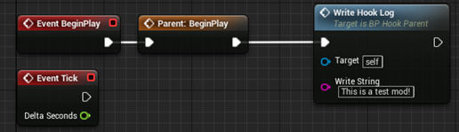

# **Welcome to HydroUMH**

**What is Hydro UMH?**

Short for Hydroneer Universal Mod Hook, HydroUMH is a way of getting mod content into the game without fiddling around with replacing existing content. Normally, if your mod adds new content or actors to the world, you have to modify an existing item to spawn your new item. This can run into all kinds of dependency issues when multiple mods overwrite the same item and its just more time consuming in general to do. HydroUMH replaces that functionality with a cleaner, easier version.

**What exactly does Hydro UMH do?**

HydroUMH allows you to create a baseline actor blueprint that will be automatically spawned into the world when the game launches. This can then be used to set up or add whatever mod content you want. It includes functionality for saving, loading, and even writing to an in-game log.

**Setting up HydroUMH**

Getting started with Hydro UMH is decently simple. Included in this repository is a file titled &quot;HydroUMH.zip&quot;. Download it, extract its contents, and place them in the &quot;content&quot; directory of your Unreal project. The next time you launch the project, you should see that a folder called &quot;HydroUMH&quot; has been added to your content viewport in the project and you will find two things within it. Inside the &quot;HydroUMH&quot; folder you will see &quot;BP\_HookParent&quot; and under &quot;HydroUMH/Hooks&quot; you will see &quot;BP\_HookTemplate&quot;. To verify everything is set up correctly, make sure &quot;BP\_HookTemplate&quot; is a child of &quot;BP\_HookParent&quot;. Now you&#39;re all set up and ready to start modding with HydroUMH.

**Using HydroUMH for Modding**

Once you have HydroUMH set up for your project, all you need to do is copy &quot;BP\_HookTemplate&quot; and rename it to your mod. As an example, we will be creating a test mod. In this case I would name mine BP\_TestMod:

Now that you have your mod hook made, open it up and move to its event graph. You should see a setup that looks like the picture below.

These are all events that will be triggered automatically by the game or by HydroUMH. BeginPlay, and Tick should already be familiar to you, though it is important that &quot;Parent: Begin Play&quot; be left where it is, and any additional code be created after it. This is so that more functionality may be added to HydroUMH in the future.

The three new events are all save and load components of HydroUMH. You can use these to build save functionality as you wish.

Another function you have available to you is the &quot;Write Hook Log&quot; function. You can use this to write data to an in-game log regarding your mod. This log can be accessed by pressing &quot;F6&quot; in game. For our test mod, we&#39;ll just write a little output to the log, so we know it&#39;s working:

When you go to package your mod, package in Unreal as normal, and go about your normal modding pipeline. The only additional asset you will need to include in your Pak is the Mod Hook asset you have created. In the case of this example, we will need to include BP\_TestMod. **Do not** include the template BP\_HookParent from your project.

The final step to ensure your mods works with HydroUMH is to the mod Pak file the same as your mod hook blueprint name. So, in the case of our test mod, we would name our Pak &quot;###\_TestMod\_P.pak&quot;. The &quot;###&quot; representing load order index can be used like normal. Make sure you also install &quot;500\_HydroUMH\_P.pak&quot; as all UMH mods depend on it.

And here we can see our in-game log saying our mod was loaded successfully and with our log output &quot;This is a test mod!&quot;

Now that we have made a working mod hook, we can add whatever we like to our mod hook. We can use it to spawn additional assets, run background code, or modify game-state variables. Its really open ended from here.

The in-game log can also be accessed from any blueprint, you&#39;ll just need to set up a proper template and add some code like this in the constructor of the blueprint you want to have access to the log:

Obviously, you&#39;ll need to create a template &quot;UI\_ModLoadList&quot; to do so. Then you can write to the debug UI at any time using that variable:

**What is the future for HydroUMH?**

Future plans for additional features in HydroUMH include some of the following:

- Item indexing for creative/cheat menus: A method for modders to add their items to a dynamic list of available items. This list could then be accessed by other mods to implement creative menus.
- Console commands using the existing debug UI. Could be used to activate events with different cheat mods, forgoing the need for a UI for each mod.
- A dynamic UI framework so that mod authors can add UI&#39;s to their mods without worrying about interference with other mods.

I&#39;m rather busy with school at the moment, so I&#39;m not sure when I&#39;ll get around to all these changes. If there&#39;s questions at any time, just shoot me a dm or ping on discord in the Foulball Hangover Server.

Happy Modding!

Rhino
